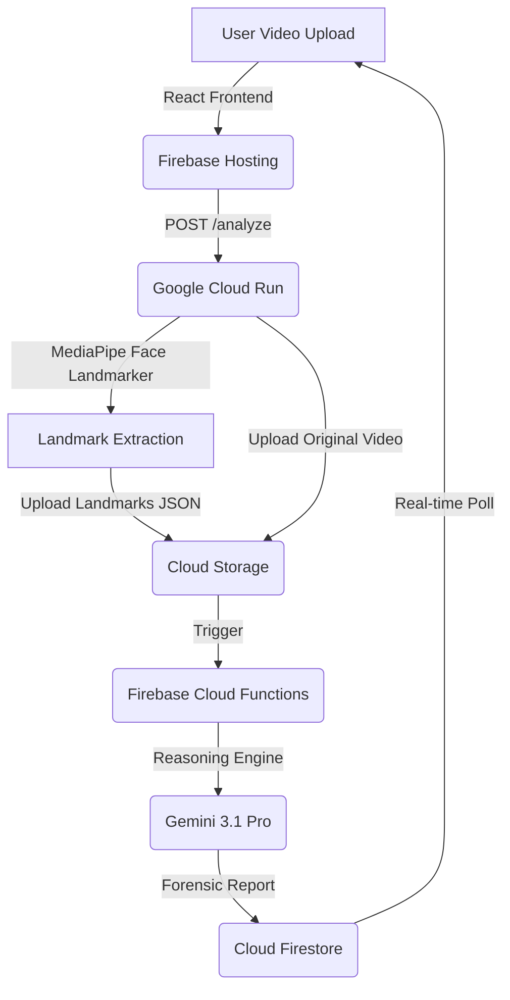

# Architecture & Technical Design: Kinetic Forensics

## 🏗️ System Overview

Kinetic Forensics follows a distributed, multi-modal architecture designed to separate heavy computation (MediaPipe) from deep reasoning (Gemini).



---

## Data Flow

```
Video File (MP4, MOV, etc)
    ↓
cv2.VideoCapture (frame by frame)
    ↓
BGR → RGB conversion
    ↓
MediaPipe Image wrapper
    ↓
FaceLandmarker.detect_for_video()
    ↓
478 landmarks per face
    ↓
Select 5 key points (chin, iris x2, eyebrows x2)
    ↓
Average iris points (5 → 1)
    ↓
Optional EMA smoothing
    ↓
Optional velocity computation
    ↓
JSON record: { frame, time, face_detected, chin, left_eye, right_eye, left_eyebrow, right_eyebrow, [chin_velocity] }
    ↓
JSON array
    ↓
output.json
```

## Key Design Decisions

### 1. Why MediaPipe Face Landmarker (not Face Mesh)?

| Aspect | Face Landmarker | Face Mesh |
|--------|-----------------|----------|
| Modern | ✓ (2024+) | ✗ (Deprecated) |
| API | Tasks (modern) | Solutions (legacy) |
| Tracking | Built-in | Manual |
| Performance | Better | Slower |

**Decision**: Face Landmarker is the official, maintained path forward.

### 2. Why Preserve All Frames (Including Misses)?

**Problem**: Skipping frames breaks time-series alignment.

**Solution**: Record every frame with `face_detected` flag:
```json
{ "frame": 2, "time": 0.066, "face_detected": false, "chin": null, ... }
```

**Benefit**: Downstream models can:
- Fill missing values via interpolation
- Detect blink events
- Maintain frame-accurate correspondence

### 3. Why EMA Smoothing is Optional?

**Raw MediaPipe output** has jitter (±2-3 pixels in 640p):
```
Frame 0: chin = [0.500, 0.600, -0.020]
Frame 1: chin = [0.501, 0.598, -0.022]  ← noise
Frame 2: chin = [0.502, 0.601, -0.018]
```

**EMA filter** (α=0.8):
```
Smoothed(t) = α × Raw(t) + (1-α) × Smoothed(t-1)
```

**Tradeoff**:
- `α=0.0` → raw, responsive, noisy
- `α=0.8` → smooth, less noisy, slight lag
- `α=0.95` → very smooth, significant lag

**Decision**: Default to 0.8, but allow `--smoothing-alpha 0` for raw output.

### 4. Why Iris Averaging?

MediaPipe Face Mesh outputs 5 iris points:
- 468, 469, 470, 471, 472 (left eye)
- 473, 474, 475, 476, 477 (right eye)

Individual iris points have high variance. Solution: average them.

**Before averaging**:
```
Iris point 468: [0.348, 0.402, 0.001]
Iris point 469: [0.349, 0.401, 0.003]
Iris point 470: [0.351, 0.399, 0.002]  ← high variance
Iris point 471: [0.350, 0.400, 0.001]
Iris point 472: [0.352, 0.402, 0.000]
```

**After averaging**:
```
Left eye: [0.350, 0.401, 0.001]  ← stable
```

### 5. Why Optional Velocity?

**Velocity** = distance traveled per second = useful for detecting:
- Jerky motion (deepfake indicator)
- Blink onset speed
- Micro-expressions

**Design choice**: Optional `--include-velocity` flag to keep default schema clean.

**Calculation**:
```python
velocity = euclidean_distance(chin_now, chin_prev) / time_delta
```

### 6. Why Timestamps via Frame Index?

**Robust to codec issues**:
```python
time_seconds = frame_id / fps
timestamp_ms = int(round(frame_id * 1000 / fps))
```

Not relying on OpenCV's frame timestamps, which can be unreliable with variable frame rates.

## Code Modules

| Module | Purpose |
|--------|---------|
| `parse_args()` | CLI argument parsing |
| `ensure_model_file()` | Auto-download MediaPipe model if missing |
| `create_face_landmarker()` | Initialize FaceLandmarker with VIDEO mode |
| `landmark_to_list()` | Convert MediaPipe NormalizedLandmark → [x, y, z] |
| `mean_landmark()` | Average N landmarks into one point |
| `extract_selected_landmarks()` | Select 5 key points from 478 |
| `smooth_point()` | Apply EMA smoothing to 3D point |
| `smooth_selected_landmarks()` | Apply smoothing to all 5 points |
| `compute_chin_velocity()` | Calculate speed in units/second |
| `process_video()` | Main processing loop |
| `main()` | Entry point |

## Performance Profile

### Time Complexity
- Per frame: **O(1)** (constant-time landmark extraction + smoothing)
- Total: **O(N)** where N = frame count

### Space Complexity
- Landmark storage: **O(N × 5)** ≈ 50-100 KB per minute of video
- Running memory: **~200-300 MB**

### Actual Throughput

| Hardware | FPS | Notes |
|----------|-----|-------|
| M1/M2 MacBook | 30-50 | With GPU acceleration |
| Intel i7 (CPU) | 15-25 | Depends on core count |
| Raspberry Pi 4 | 5-10 | With quantized model |

## Error Handling

| Error | Handling |
|-------|----------|
| Video file not found | FileNotFoundError → early exit |
| Corrupted frame | Skip frame, log, continue |
| No face detected | Record with face_detected=false |
| Model download fails | User manual download option |
| BGR/RGB mismatch | Explicit cv2.cvtColor conversion |

## Testing Recommendations

### Unit Tests (if extending)
```python
def test_mean_landmark():
    """Test iris averaging."""
    iris_points = [...]  # 5 points
    result = mean_landmark(iris_points, [0,1,2,3,4])
    assert len(result) == 3
    assert all(0 <= x <= 1 for x in result)

def test_ema_smoothing():
    """Test EMA filter."""
    current = [0.5, 0.5, 0.0]
    previous = [0.4, 0.6, 0.0]
    result = smooth_point(current, previous, alpha=0.8)
    # Should be closer to current than previous
    assert result != current  # Not zero alpha
    assert result != previous  # Not one alpha
```

### Integration Tests
```bash
# Test with small video
python sensor.py test_video_10s.mp4 --verbose --output test_output.json

# Verify JSON structure
python -c "
import json
with open('test_output.json') as f:
    data = json.load(f)
    assert len(data) == expected_frame_count
    assert 'face_detected' in data[0]
"
```

