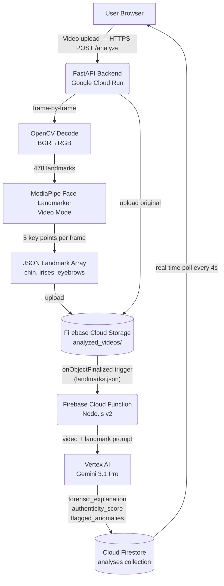
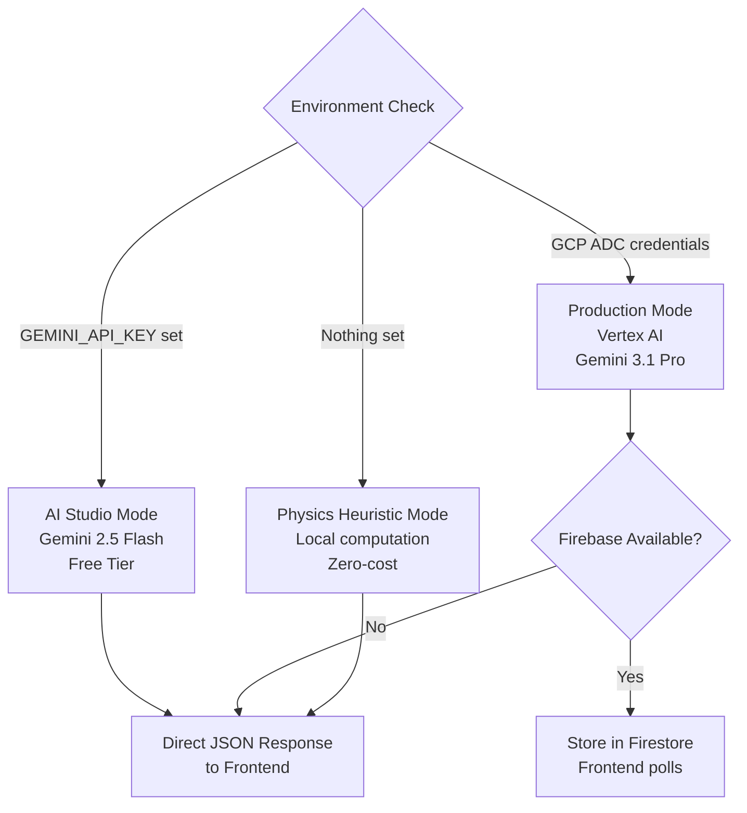

# Architecture & Technical Design: Kinetic Forensics

## System Overview

Kinetic Forensics implements a **multi-modal, event-driven deepfake detection pipeline** on Google Cloud Platform. The system separates concerns cleanly: OpenCV handles frame decoding, MediaPipe handles spatial landmark extraction, and Gemini AI handles temporal reasoning and biological physics analysis.

---

## 1. Production Cloud Architecture


```mermaid
graph TD
    A[User Browser] -->|"Video upload — HTTPS POST /analyze"| B(FastAPI Backend\nGoogle Cloud Run)
    B -->|"frame-by-frame"| C[OpenCV Decode\nBGR→RGB]
    C -->|"478 landmarks"| D[MediaPipe Face Landmarker\nVideo Mode]
    D -->|"5 key points per frame"| E[JSON Landmark Array\n chin, irises, eyebrows]
    E -->|upload| F[(Firebase Cloud Storage\nanalyzed_videos/)]
    B -->|upload original| F
    F -->|"onObjectFinalized trigger\n(landmarks.json)"| G(Firebase Cloud Function\nNode.js v2)
    G -->|"video + landmark prompt"| H[Vertex AI\nGemini 3.1 Pro]
    H -->|"forensic_explanation\nauthenticity_score\nflagged_anomalies"| I[(Cloud Firestore\nanalyses collection)]
    I -->|"real-time poll every 4s"| A
```

---

## 2. Dual-Mode Architecture (v2.0)

The system supports three operating modes through graceful environment-variable detection:


```mermaid
graph TD
    ENV{Environment Check} -->|GEMINI_API_KEY set| AISTUDIO[AI Studio Mode\nGemini 2.5 Flash\nFree Tier]
    ENV -->|GCP ADC credentials| VERTEX[Production Mode\nVertex AI\nGemini 3.1 Pro]
    ENV -->|Nothing set| MOCK[Physics Heuristic Mode\nLocal computation\nZero-cost]

    AISTUDIO --> DIRECT[Direct JSON Response\nto Frontend]
    VERTEX --> FIREBASE_MODE{Firebase Available?}
    FIREBASE_MODE -->|Yes| FIRESTORE[Store in Firestore\nFrontend polls]
    FIREBASE_MODE -->|No| DIRECT
    MOCK --> DIRECT
```

---

## 3. Physics Analysis Pipeline

```
Video File (MP4 / MOV / WebM)
    │
    ▼  OpenCV VideoCapture — frame-by-frame
BGR Frame Buffer
    │
    ▼  cv2.cvtColor(BGR → RGB)
RGB Image
    │
    ▼  mediapipe.FaceLandmarker.detect_for_video(timestamp_ms)
478 NormalizedLandmarks  [x ∈ 0.0–1.0, y ∈ 0.0–1.0, z = depth estimate]
    │
    ▼  Landmark Selection (5 anatomical points)
┌────────────────────────────────────────────────────┐
│  Chin       : index 152                            │
│  Left Iris  : indices 468–472 → averaged centroid  │
│  Right Iris : indices 473–477 → averaged centroid  │
│  Left Eyebrow  : index 70                          │
│  Right Eyebrow : index 300                         │
└────────────────────────────────────────────────────┘
    │
    ▼  Optional: EMA Smoothing  Smoothed(t) = α·Raw(t) + (1−α)·Smoothed(t−1)
    │            Default α = 0.8
    │
    ▼  Optional: Velocity     v = dist(chin_now, chin_prev) / Δt
    │
    ▼  JSON Record per Frame
{
  "frame": 42,
  "time": 1.4,
  "face_detected": true,
  "chin": [0.501, 0.641, -0.020],
  "left_eye": [0.349, 0.400, 0.001],
  "right_eye": [0.651, 0.400, 0.001],
  "left_eyebrow": [0.299, 0.251, 0.000],
  "right_eyebrow": [0.701, 0.251, 0.000],
  "chin_velocity": 0.0043       ← optional
}
    │
    ▼  Gemini Analysis / Physics Heuristic Engine
Forensic Report JSON
```

---

## 4. Physics Heuristic Engine (Offline Mode)

When no Gemini API is available, the system computes real statistics from extracted landmark data:

### Metric 1 — Chin Velocity Variance (Biological Noise Check)

```python
# For each consecutive detected frame pair:
velocity_i = euclidean_distance(chin[i], chin[i-1]) / delta_time

jitter_ratio = std_dev(velocities) / mean(velocities)

# Thresholds:
# jitter_ratio < 0.15  →  suspiciously smooth (AI-generated)
# jitter_ratio > 1.50  →  excessive noise (diffusion flicker)
# 0.15–1.50            →  normal biological range
```

**Why this works:** Human head movements have mass. Muscles produce non-zero jitter (3–7 Hz micro-tremors). AI face-swap models typically use smooth interpolation between key poses, producing unnaturally low velocity variance.

### Metric 2 — Eye Saccade Discreteness

```python
# Per frame:
displacement = sqrt((left_eye_dx² + left_eye_dy²) + (right_eye_dx² + right_eye_dy²))
saccade_peaks = count(displacement > 0.005)

# If saccade_peaks < 2 over 30+ frames → linear drift detected
```

**Why this works:** Real human eyes move in discrete high-velocity jumps (saccades). Between saccades, eyes are mostly stationary. AI-generated irises smoothly interpolate positions, creating a linear motion signature that violates the biological "Main Sequence" velocity curve.

### Metric 3 — Face Detection Continuity

```python
detection_rate = len(face_detected_frames) / total_frames

# detection_rate < 0.70 → potential face-swap warping artifacts
```

---

## 5. Key Design Decisions

### Why Iris Averaging?

MediaPipe outputs 5 perimeter points per iris (scatter over the iris boundary). Averaging:
- Eliminates point-level jitter
- Gives a stable geometric centroid
- Makes velocity analysis more meaningful

```
Raw: [0.348, 0.402], [0.349, 0.401], [0.351, 0.399], [0.350, 0.400], [0.352, 0.402]
→ Averaged: [0.350, 0.401]  (stable centroid)
```

### Why Preserve Null Frames?

Skipping frames without detected faces breaks time-series alignment. Recording `face_detected: false` with null landmarks allows:
- Blink event detection (rapid face-loss)
- Frame-accurate downstream interpolation
- Continuity scoring (Metric 3 above)

### Why Optional EMA Smoothing?

Raw MediaPipe jitter (±2–3 pixels in 640p video) can mask true motion signals. EMA with `α=0.8` suppresses this measurement noise while preserving real motion. Raw output (`α=0`) is available for research pipelines that need unfiltered data.

### Why Timestamp via Frame Index?

```python
timestamp_ms = int(round(frame_id * 1000 / fps))
```

OpenCV's `CAP_PROP_POS_MSEC` is unreliable with variable frame-rate codecs. Computing from frame index and FPS is deterministic across all video formats.

### Why Cloud Run (not Cloud Functions) for Extraction?

MediaPipe requires:
- ~200–300 MB memory
- Preloaded model file (~30 MB)
- CPU-intensive frame-by-frame processing

Cloud Functions v2 max memory (1 GiB) could support it, but startup latency and cold starts make Cloud Run a better choice for video processing workloads. The landmark extraction container stays warm under load.

---

## 6. Module Reference

| Module | Exported | Purpose |
|---|---|---|
| `sensor.py` | `process_video()` | Main video processing loop |
| `sensor.py` | `extract_selected_landmarks()` | 478 → 5 key points |
| `sensor.py` | `smooth_point()` | EMA filter on a 3D point |
| `sensor.py` | `compute_chin_velocity()` | Euclidean distance / time |
| `deepfake_detection.py` | `generate()` | 3-tier Gemini/Mock analysis |
| `deepfake_detection.py` | `run_mock_analysis()` | Physics heuristic computation |
| `firebase_utils.py` | `initialize_firebase()` | Resilient Firebase init |
| `firebase_utils.py` | `is_firebase_available()` | Mode detection flag |
| `firebase_utils.py` | `upload_file_to_storage()` | GCS blob upload |
| `firebase_utils.py` | `save_analysis_to_firestore()` | Firestore write |
| `server.py` | `GET /` | Health + mode status |
| `server.py` | `POST /analyze` | Full analysis pipeline |

---

## 7. Performance Profile

### Time Complexity
- Per frame: **O(1)** — constant-time landmark extraction + smoothing
- Full video: **O(N)** where N = total frame count

### Space Complexity
- Landmark storage: **O(N × 5)** ≈ 50–100 KB per minute of video
- Peak working memory: **200–300 MB** (MediaPipe model loaded)

### Cloud Run Cold Start
- First request: ~4–6 seconds (model load + MediaPipe init)
- Subsequent requests: ~200ms (model stays loaded)
- Minimum instances: set to 1 to eliminate cold starts in production

---

## 8. Error Handling Matrix

| Error Condition | Handling Strategy |
|---|---|
| Firebase credentials missing | Graceful degradation → local mode (non-fatal) |
| Gemini API key missing | Falls through to Vertex AI → then physics mock |
| Vertex AI auth failure | Falls through to physics mock (non-fatal) |
| Video file not found | `FileNotFoundError` → HTTP 500 with message |
| Corrupted video frame | Skip frame, log, continue processing |
| No face detected (frame) | Record `face_detected: false`, preserve timeline |
| MediaPipe model missing | Auto-download from Google storage |
| Temp file cleanup failure | Logged, non-fatal (eventual cleanup) |
| Gemini JSON parse failure | Raw response wrapped in `{"raw_output": ...}` |
