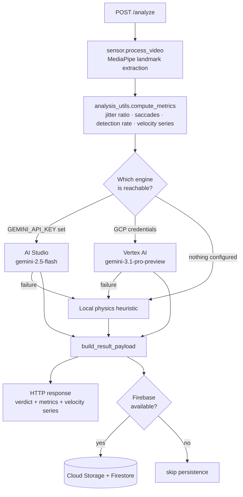
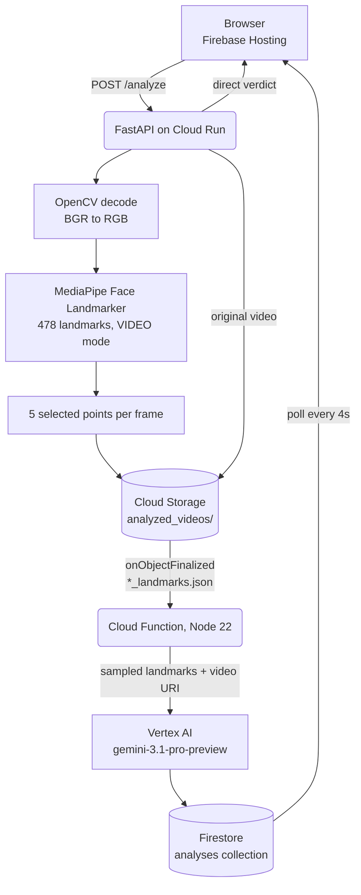

# Architecture & Technical Design

Companion to the [README](README.md). The README explains how to run the system; this document
explains why it is built the way it is. Read it before changing the analysis path.

---

## 1. Design principle: one code path, three environments

The system never branches on "am I local or in the cloud". It branches on **what is actually
available**, checked at runtime:


```mermaid
graph TD
    REQ[POST /analyze] --> EXTRACT[sensor.process_video<br/>MediaPipe landmark extraction]
    EXTRACT --> METRICS[analysis_utils.compute_metrics<br/>jitter ratio · saccades · detection rate · velocity series]
    METRICS --> ENGINE{Which engine<br/>is reachable?}

    ENGINE -->|GEMINI_API_KEY set| AIS[AI Studio<br/>gemini-2.5-flash]
    ENGINE -->|GCP credentials| VTX[Vertex AI<br/>gemini-3.1-pro-preview]
    ENGINE -->|nothing configured| HEU[Local physics heuristic]

    AIS -->|failure| HEU
    VTX -->|failure| HEU

    AIS --> PAYLOAD[build_result_payload]
    VTX --> PAYLOAD
    HEU --> PAYLOAD

    PAYLOAD --> RESP[HTTP response<br/>verdict + metrics + velocity series]
    PAYLOAD --> FB{Firebase<br/>available?}
    FB -->|yes| STORE[(Cloud Storage + Firestore)]
    FB -->|no| SKIP[skip persistence]
```

Two consequences worth preserving:

1. **The metrics are computed before the engine runs.** Jitter ratio, saccade count, detection
   rate and the per-frame velocity series come from the landmark data, not from the model. They
   are present in every response, including when the model fails.
2. **Failure of a cloud tier is not failure of the request.** It downgrades the engine and sets
   `usedFallback: true`. Persistence failures are logged and swallowed entirely.

---

## 2. Production cloud pipeline


```mermaid
graph TD
    A[Browser<br/>Firebase Hosting] -->|POST /analyze| B(FastAPI on Cloud Run)
    B --> C[OpenCV decode<br/>BGR to RGB]
    C --> D[MediaPipe Face Landmarker<br/>478 landmarks, VIDEO mode]
    D --> E[5 selected points per frame]
    E --> F[(Cloud Storage<br/>analyzed_videos/)]
    B -->|original video| F
    F -->|onObjectFinalized<br/>*_landmarks.json| G(Cloud Function, Node 22)
    G -->|sampled landmarks + video URI| H[Vertex AI<br/>gemini-3.1-pro-preview]
    H --> I[(Firestore<br/>analyses collection)]
    I -->|poll every 4s| A
    B -->|direct verdict| A
```

**Filename coupling.** The Cloud Function triggers on any object ending `_landmarks.json` and
derives the video path by replacing that suffix with `.mp4`. `upload_file_to_storage()` is the
single place that constructs both names — change one and you must change the other.

**Two result channels.** Cloud Run returns the verdict directly *and* Firestore receives a copy.
The frontend uses whichever arrives: `data.result` short-circuits the poll. The polling path
exists for the pure event-driven flow where the Cloud Function is the analyst.

---

## 3. Landmark extraction

```
Video (MP4 / MOV / WebM)
    |
    v  cv2.VideoCapture — sequential decode
BGR frame
    |
    v  cv2.cvtColor(BGR -> RGB)
    v  mp.Image(SRGB)
    v  FaceLandmarker.detect_for_video(image, timestamp_ms)
478 NormalizedLandmarks  [x, y in 0..1 · z = relative depth]
    |
    v  Selection
       chin           index 152
       left iris      indices 468-472  -> centroid
       right iris     indices 473-477  -> centroid
       left eyebrow   index 70
       right eyebrow  index 300
    |
    v  EMA smoothing (optional)   S(t) = a*S(t-1) + (1-a)*R(t),  a = 0.8 default
    v  Chin velocity (optional)   v = ||chin(t) - chin(t-1)|| / dt
    |
    v  One JSON record per frame — including frames with no face
```

### Design decisions

**Face Landmarker, not Face Mesh.** The Tasks API (2024+) has built-in tracking across frames,
better performance, and is actively maintained. The legacy Solutions `FaceMesh` API is
deprecated and requires manual tracking.

**Iris centroid averaging.** MediaPipe emits 5 perimeter points per iris, each carrying its own
noise. Averaging produces a stable pupil centre — necessary because the saccade test compares
per-frame displacements against a 0.005 threshold, which is the same order as raw point noise.

**Frames with no face are preserved.** Recording `face_detected: false` with `null` coordinates
keeps the time axis intact. Dropping them would silently compress time, corrupt every velocity
computation, and make the detection-rate metric impossible.

**Timestamps from frame index, not `CAP_PROP_POS_MSEC`.** `timestamp_ms = round(frame_id * 1000 / fps)`
is deterministic across containers and codecs; `POS_MSEC` is unreliable with variable frame rate
sources. MediaPipe's VIDEO mode also requires monotonically increasing timestamps.

**Smoothing resets on face loss.** When detection drops, `previous_smoothed_landmarks`,
`previous_chin` and `previous_time` are cleared, so the first frame after a gap does not produce
a spurious velocity spike across the missing interval.

---

## 4. Metrics layer (`analysis_utils.py`)

Extracted into its own module so the heuristic engine, the API response and the frontend chart
all read from **one** implementation. Before this existed, the verdict and the chart came from
different code — which is how the chart ended up displaying values unrelated to the analysis.

| Function | Returns |
|---|---|
| `chin_velocity_series(records)` | `[{t, v}]` per detected frame. Uses `chin_velocity` if present, otherwise recomputes from coordinates |
| `compute_metrics(records)` | `totalFrames`, `framesWithFace`, `detectionRate`, `meanVelocity`, `stdVelocity`, `jitterRatio`, `saccadePeaks`, `eyeSamples`, `series` |
| `downsample_series(series, n)` | Bucket-**averaged** series of at most `n` points |

**Why bucket averaging rather than stride sampling.** Stride sampling aliases high-frequency
tremor into whatever pattern the stride happens to intersect — which is precisely the signal the
chart exists to show. Averaging preserves the local energy of the signal at every scale.

**Velocity resilience.** `chin_velocity_series` recomputes velocity when the field is absent, so
landmark files produced without `--include-velocity` still chart correctly.

---

## 5. Physics heuristic engine

Runs when no Gemini tier is reachable. It computes real statistics — it is not a placeholder.

### Metric 1 — chin velocity variance (biological noise)

```python
v_i          = ||chin[i] - chin[i-1]|| / dt
jitter_ratio = std(v) / mean(v)

jitter_ratio < 0.15  ->  -35 points   suspiciously smooth (synthetic interpolation)
jitter_ratio > 1.50  ->  -15 points   excessive noise (diffusion flicker)
0.15 .. 1.50         ->   no penalty  normal biological range
```

Human head movement has mass, and muscle activity produces 3–7 Hz micro-tremor. Face-swap
models interpolate between key poses, which suppresses velocity variance.

The ratio is deliberately **scale-invariant**: EMA smoothing scales σ and μ together, so the
metric survives the default `alpha = 0.8` intact. This was verified empirically across
`alpha ∈ {0.0, 0.5, 0.8, 0.9}`.

### Metric 2 — saccade discreteness

```python
displacement = sqrt(dx_left^2 + dy_left^2 + dx_right^2 + dy_right^2)
saccade_peaks = count(displacement > 0.005)

eye_samples > 30 and saccade_peaks < 2  ->  -25 points
```

Real gaze moves in discrete high-velocity jumps and is otherwise near-stationary. Generated
irises slide linearly, violating the Main Sequence velocity curve.

Unlike metric 1, this threshold is **absolute**, so it is smoothing-sensitive: a very high
`--smoothing-alpha` (0.9+) can damp genuine saccades below 0.005. Keep alpha at or below 0.8.

### Metric 3 — temporal continuity

```python
detection_rate = frames_with_face / total_frames
detection_rate < 0.70  ->  -10 points
```

Face-swap warping causes frame-level detection failures at boundary conditions.

### Scoring

Start at 85, subtract penalties, clamp to `[5, 98]`, then apply a ±3 perturbation seeded from
the first detected chin coordinate. The seed comes from the data itself, so **the same clip
always produces the same score** — reproducibility is a requirement here, not a nicety.

---

## 6. Result construction (`server.py`)

```python
raw   = engine output (text)
       -> extract_json()      # handles code fences and chatty preambles
       -> coerce_score()      # -> float in [0, 100], or None
```

`coerce_score` returns `None` for anything unusable and **has no default value**. This is
deliberate: an earlier version defaulted a missing score to 100, which meant every unparseable
model response was reported to the user as "Real, 0% deepfake probability" — the most dangerous
possible failure mode for a detector.

| `coerce_score` result | Verdict | `probability` / `confidence` |
|---|---|---|
| numeric | `Fake` if `100 - score >= 50`, else `Real` | populated |
| `None` | `Inconclusive` | `null`, with a `warning` field |

Measured kinetic metrics and the velocity series are attached in **all** cases, because they
never depended on the model.

### Request isolation

Each request gets its own `tempfile.mkdtemp()` directory, removed in a `finally` block.
Previously temp files were written into the process working directory with second-resolution
timestamps, so two uploads in the same second overwrote each other.

---

## 7. Frontend contract

`App.jsx` renders only what the backend sends:

| UI element | Source |
|---|---|
| Deepfake probability gauge | `result.probability` (`N/A` when `null`) |
| Verdict badge | `result.status` — `Real` / `Fake` / `Inconclusive` |
| Kinetic jitter chart | `result.jitterSeries` — real measured velocities |
| Mean line and ±1σ band | `result.meanVelocity`, `result.stdVelocity` |
| Analysis Engine row | `result.engine` and `result.model` |
| Flagged anomalies | `result.anomalies` |
| Forensic report | `result.report` |

The chart renders an explicit "Per-frame velocity data is not available for this run" panel
when the series is empty (the Firestore polling path does not carry one). It never fabricates
data to fill the space, and the engine label is never hard-coded.

**Backend routing.** `localhost` / `127.0.0.1` unconditionally targets `http://localhost:8000`.
`window.__APP_CONFIG__.BACKEND_URL` from `public/config.js` applies only to deployed builds.
The precedence matters: the reverse order silently broke local development, because
`config.js` is always present and always points at Cloud Run.

---

## 8. Module reference

| Module | Exports | Purpose |
|---|---|---|
| `sensor.py` | `process_video()` | Decode + landmark extraction loop |
| | `extract_selected_landmarks()` | 478 landmarks -> 5 anatomical points |
| | `smooth_point()` | EMA filter on a 3D point |
| | `compute_chin_velocity()` | Euclidean displacement / dt |
| `analysis_utils.py` | `compute_metrics()` | All kinetic statistics |
| | `chin_velocity_series()` | Per-frame velocity, recomputed if absent |
| | `downsample_series()` | Bucket-averaged series for the chart |
| `deepfake_detection.py` | `analyze()` | Tier selection; returns text + engine identity |
| | `generate()` | Backwards-compatible text-only wrapper |
| | `describe_engine()` | Active tier without invoking it |
| | `run_mock_analysis()` | Physics heuristic |
| | `summarize_landmarks()` | Prompt-size sampling |
| `firebase_utils.py` | `initialize_firebase()` | Non-raising Admin SDK init |
| | `is_firebase_available()` | Mode gate used everywhere |
| | `upload_file_to_storage()` | Storage upload with the paired naming scheme |
| | `save_analysis_to_firestore()` | Firestore write |
| `server.py` | `GET /`, `GET /health` | Liveness + active engine |
| | `POST /analyze` | Full pipeline |
| | `extract_json()`, `coerce_score()` | Defensive response parsing |

---

## 9. Performance

| Aspect | Figure |
|---|---|
| Per-frame cost | O(1) — constant-time extraction and smoothing |
| Full video | O(N) in frame count |
| Landmark JSON | ~50–100 KB per minute of video |
| Peak memory | 200–300 MB with the model loaded |
| Throughput | 15–50 fps depending on CPU |
| Cloud Run cold start | ~4–6 s (model load); ~200 ms warm |
| Model bundle | `face_landmarker.task`, ~3.7 MB (float16) |
| Prompt payload | Sampled to ≤ 240 frames / 20 000 chars |

Set Cloud Run minimum instances to 1 to eliminate cold starts in production.

---

## 10. Error handling matrix

| Condition | Handling |
|---|---|
| Firebase credentials missing | Logged, `is_firebase_available()` false, local mode (non-fatal) |
| `GEMINI_API_KEY` absent | Try Vertex AI, then the physics heuristic |
| Gemini / Vertex call fails | Physics heuristic runs; `usedFallback: true` in the response |
| Model returns unparseable text | `extract_json` -> `raw_output`; verdict is `Inconclusive`, never `Real` |
| Score present but malformed | `coerce_score` extracts a number or returns `None`; clamped to 0–100 |
| Empty upload | HTTP 400 |
| Upload over the size limit | HTTP 413 |
| No face in any frame | HTTP 422 with actionable guidance |
| Corrupted video frame | Recorded as `face_detected: false`, processing continues |
| Landmark file missing or corrupt | Warning logged, metrics computed over an empty set |
| MediaPipe model missing | Downloaded automatically on first use |
| Firebase upload or Firestore write fails | Logged; the HTTP response still succeeds |
| Temp directory cleanup | `finally` block with `ignore_errors=True` |
